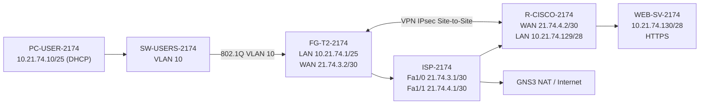
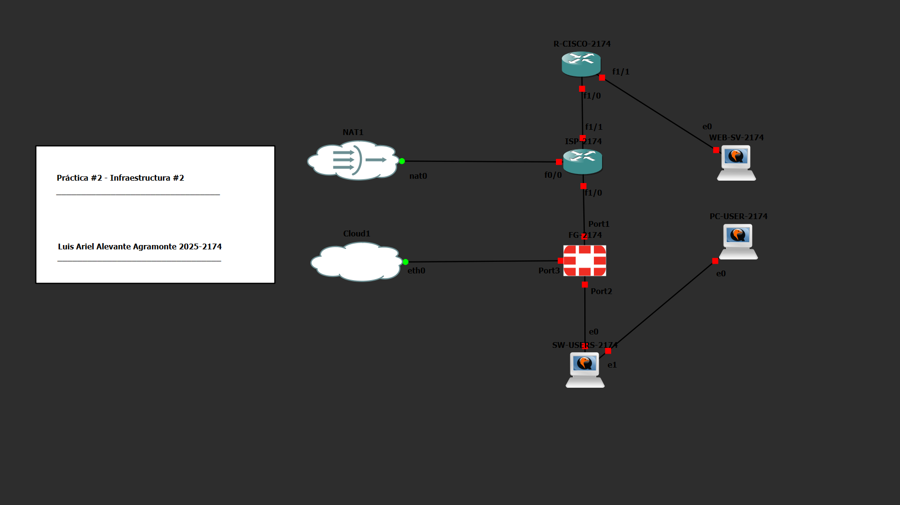

# Práctica #2 — Topología #2: VPN Site-to-Site FortiGate ↔ Cisco

> **Video de demostración:** [🎥 Ver video](PENDIENTE-URL-DEL-VIDEO)

**Asignatura:** Seguridad de Redes  
**Estudiante:** Luis Ariel Alevante Agramonte  
**Matrícula:** 2025-2174

---

## 1. Objetivo

Implementar una infraestructura en GNS3 en la que una red de usuarios se comunique con un servidor HTTPS remoto exclusivamente a través de una **VPN IPsec Site-to-Site entre un FortiGate y un router Cisco**.

La práctica demuestra que:

- La red de usuarios opera en **VLAN 10** y obtiene direccionamiento mediante DHCP.
- El FortiGate funciona como gateway de la red de usuarios y proporciona salida a Internet mediante NAT.
- El servidor HTTPS se encuentra en una subred `/28` detrás del router Cisco.
- El router ISP proporciona tránsito entre las WAN del FortiGate y del router Cisco, además de salida a Internet.
- El tráfico entre `10.21.74.0/25` y `10.21.74.128/28` se protege mediante IPsec.
- El router Cisco aplica **NAT exemption** al tráfico destinado al túnel VPN.
- El servidor responde por HTTPS cuando la VPN está activa.
- Al deshabilitar el túnel, la comunicación entre usuario y servidor deja de funcionar.
- Al habilitar nuevamente la VPN, la conectividad se restaura.

---

## 2. Topología





---

## 3. Plan de direccionamiento

| Equipo | Interfaz / función | Dirección |
|---|---|---|
| ISP-2174 | Fa0/0 hacia GNS3 NAT | DHCP |
| ISP-2174 | Fa1/0 hacia FortiGate | `21.74.3.1/30` |
| FG-T2-2174 | WAN-ISP / port1 | `21.74.3.2/30` |
| FG-T2-2174 | VLAN10-USERS | `10.21.74.1/25` |
| PC-USER-2174 | VLAN 10 / DHCP | `10.21.74.10/25` |
| ISP-2174 | Fa1/1 hacia R-CISCO | `21.74.4.1/30` |
| R-CISCO-2174 | Fa1/0 WAN | `21.74.4.2/30` |
| R-CISCO-2174 | Fa1/1 LAN servidor | `10.21.74.129/28` |
| WEB-SV-2174 | ens3 | `10.21.74.130/28` |
| FG-T2-2174 | port3 administración | `192.168.79.99/24` |

Más detalle: [`docs/direccionamiento.md`](docs/direccionamiento.md)

---

## 4. Componentes del entorno

- GNS3
- GNS3 VM sobre VMware
- 1 × FortiGate VM64-KVM 7.0.9
- 2 × Cisco C7200:
  - `ISP-2174`
  - `R-CISCO-2174`
- Cisco IOSvL2 como switch
- Ubuntu Server para el usuario
- Ubuntu Server para el servidor web
- Apache2 con HTTPS
- GNS3 NAT para salida a Internet

---

## 5. Configuración implementada

### 5.1 ISP y NAT

El router `ISP-2174` interconecta la WAN del FortiGate con la WAN del router Cisco.

- `Fa1/0` → `21.74.3.1/30`
- `Fa1/1` → `21.74.4.1/30`
- `Fa0/0` → dirección obtenida por DHCP desde GNS3 NAT
- `Fa1/0` y `Fa1/1` configuradas como `ip nat inside`
- `Fa0/0` configurada como `ip nat outside`
- PAT mediante la dirección obtenida en `Fa0/0`

### 5.2 VLAN 10 y trunk

El usuario pertenece a la VLAN 10.

- `Gi0/0`: trunk 802.1Q hacia `port2` del FortiGate.
- VLAN permitida en el trunk: `10`.
- `Gi0/1`: puerto access VLAN 10 hacia `PC-USER-2174`.

### 5.3 FortiGate — FG-T2-2174

El FortiGate funciona como gateway y firewall de la red de usuarios.

**WAN**

- IP: `21.74.3.2/30`
- Gateway: `21.74.3.1`
- Interfaz: `WAN-ISP (port1)`

**VLAN 10 / DHCP**

- Interfaz: `VLAN10-USERS`
- Gateway: `10.21.74.1/25`
- VLAN ID: `10`
- Pool DHCP: `10.21.74.10 - 10.21.74.100`
- DNS entregados: `8.8.8.8` y `1.1.1.1`

**Política de salida**

- Nombre: `USER-TO-INTERNET`
- Entrada: `VLAN10-USERS`
- Salida: `WAN-ISP (port1)`
- Acción: `ACCEPT`
- NAT habilitado

### 5.4 Router Cisco — R-CISCO-2174

El router Cisco representa el segundo extremo de la VPN y el gateway de la red del servidor.

**WAN**

- `Fa1/0`: `21.74.4.2/30`
- Gateway por defecto: `21.74.4.1`
- `ip nat outside`

**LAN del servidor**

- `Fa1/1`: `10.21.74.129/28`
- `ip nat inside`

**NAT exemption**

El tráfico entre las redes privadas del VPN no se traduce:

```text
10.21.74.128/28  ↔  10.21.74.0/25
```

El resto del tráfico de la LAN del servidor puede utilizar PAT a través de `Fa1/0`.

### 5.5 VPN IPsec Site-to-Site

El túnel conecta:

- Red de usuarios: `10.21.74.0/25`
- Red del servidor: `10.21.74.128/28`
- Peer FortiGate: `21.74.3.2`
- Peer Cisco: `21.74.4.2`

**IKE / Phase 1**

- IKEv1
- Main Mode
- Propuesta utilizada: DES / SHA1
- DH Group 5
- Lifetime: `86400` segundos
- Autenticación mediante Pre-Shared Key

**IPsec / Phase 2**

- Transform-set Cisco: `esp-des esp-sha-hmac`
- PFS: Group 5
- Lifetime: `43200` segundos
- Tráfico protegido:
  - Local Cisco: `10.21.74.128/28`
  - Remoto Cisco: `10.21.74.0/25`

> **Seguridad:** la PSK real no se publica en este repositorio.

### 5.6 Usuario

`PC-USER-2174` obtiene su configuración mediante DHCP:

- IP observada: `10.21.74.10/25`
- Gateway: `10.21.74.1`
- DNS: `8.8.8.8` y `1.1.1.1`

### 5.7 Servidor HTTPS

El servidor Ubuntu utiliza:

- IP: `10.21.74.130/28`
- Gateway: `10.21.74.129`
- Servicio: Apache2
- Protocolo validado: HTTPS/443

---

## 6. Validación

### 6.1 Estado del túnel en FortiGate

En la GUI de FortiGate, `VPN-FG-CISCO` aparece con estado **Up**.

Evidencia: [`12-fortigate-vpn-active.png`](evidencias/12-fortigate-vpn-active.png)

### 6.2 IKE activo en Cisco

El comando:

```text
show crypto isakmp sa
```

muestra el estado:

```text
QM_IDLE
ACTIVE
```

Esto confirma que la negociación IKE está establecida.

### 6.3 Tráfico IPsec cifrado

El comando:

```text
show crypto ipsec sa
```

muestra tráfico real atravesando el túnel, incluyendo contadores de:

- `encaps`
- `encrypt`
- `decaps`
- `decrypt`

Evidencia: [`14-cisco-ipsec-sa.png`](evidencias/14-cisco-ipsec-sa.png)

### 6.4 ICMP con VPN activa

Desde `PC-USER-2174`:

```bash
ping -c 4 10.21.74.130
```

Resultado observado:

```text
4 packets transmitted, 4 received, 0% packet loss
```

Evidencia: [`15-vpn-on-ping.png`](evidencias/15-vpn-on-ping.png)

### 6.5 HTTPS a través de la VPN

Desde `PC-USER-2174`:

```bash
curl -k -I https://10.21.74.130
```

Resultado:

```text
HTTP/1.1 200 OK
Server: Apache/2.4.66 (Ubuntu)
```

Evidencia: [`16-vpn-on-https.png`](evidencias/16-vpn-on-https.png)

### 6.6 Demostración de dependencia del túnel

Se deshabilita temporalmente `VPN-FG-CISCO`.

Con el túnel deshabilitado:

- El ping muestra `Destination Net Unreachable`.
- Se obtiene `100% packet loss`.
- La conexión HTTPS al puerto 443 falla.

Evidencia: [`17-vpn-off-sin-acceso.png`](evidencias/17-vpn-off-sin-acceso.png)

### 6.7 Restauración

Después de habilitar nuevamente la VPN:

- La conectividad hacia `10.21.74.130` se restaura.
- HTTPS vuelve a responder correctamente.

Evidencia: [`18-vpn-restaurado.png`](evidencias/18-vpn-restaurado.png)

La secuencia completa de validación está documentada en [`docs/validacion.md`](docs/validacion.md).

---

## 7. Evidencias principales

| Evidencia | Descripción |
|---|---|
| [`01-topologia-infraestructura-2.png`](evidencias/01-topologia-infraestructura-2.png) | Topología completa |
| [`02-isp-interfaces.png`](evidencias/02-isp-interfaces.png) | Interfaces del ISP |
| [`03-isp-rutas.png`](evidencias/03-isp-rutas.png) | Tabla de rutas del ISP |
| [`04-cisco-interfaces.png`](evidencias/04-cisco-interfaces.png) | Interfaces de R-CISCO |
| [`05-cisco-rutas.png`](evidencias/05-cisco-rutas.png) | Tabla de rutas de R-CISCO |
| [`06-cisco-nat-exemption.png`](evidencias/06-cisco-nat-exemption.png) | Exención NAT para tráfico VPN |
| [`07-switch-vlan10.png`](evidencias/07-switch-vlan10.png) | VLAN 10 |
| [`08-switch-trunk.png`](evidencias/08-switch-trunk.png) | Trunk 802.1Q |
| [`09-pc-user-dhcp.png`](evidencias/09-pc-user-dhcp.png) | DHCP del usuario |
| [`10-fortigate-interfaces.png`](evidencias/10-fortigate-interfaces.png) | Interfaces FortiGate |
| [`11-fortigate-policy-internet.png`](evidencias/11-fortigate-policy-internet.png) | Política USER-TO-INTERNET |
| [`12-fortigate-vpn-active.png`](evidencias/12-fortigate-vpn-active.png) | VPN activa en FortiGate |
| [`13-cisco-isakmp-active.png`](evidencias/13-cisco-isakmp-active.png) | IKE activo en Cisco |
| [`14-cisco-ipsec-sa.png`](evidencias/14-cisco-ipsec-sa.png) | SA IPsec y tráfico cifrado |
| [`15-vpn-on-ping.png`](evidencias/15-vpn-on-ping.png) | Ping con VPN activa |
| [`16-vpn-on-https.png`](evidencias/16-vpn-on-https.png) | HTTPS con VPN activa |
| [`17-vpn-off-sin-acceso.png`](evidencias/17-vpn-off-sin-acceso.png) | Sin acceso con VPN deshabilitada |
| [`18-vpn-restaurado.png`](evidencias/18-vpn-restaurado.png) | Servicio restaurado |

---

## 8. Running-configs

Las configuraciones están disponibles en [`running-configs/`](running-configs/):

- `ISP-2174.txt`
- `R-CISCO-2174-sanitized.txt`
- `SW-USERS-2174.txt`
- `FG-T2-2174-sanitized.conf`

> **Seguridad:** los archivos públicos fueron sanitizados para eliminar u ocultar contraseñas, PSK, claves privadas y otros secretos. La configuración funcional necesaria para documentar interfaces, rutas, NAT, políticas y VPN se conserva.

---

## 9. Scripts

La carpeta [`scripts/`](scripts/) contiene archivos de apoyo para reproducir y validar la infraestructura:

- `web-server-https-setup.sh`
- `test-vpn-connectivity.sh`
- `switch-setup.txt`
- `README.md`

---

## 10. Resultado

La **Infraestructura 2** cumple el objetivo principal: el usuario de la VLAN 10 puede alcanzar el servidor HTTPS remoto mediante una **VPN IPsec Site-to-Site entre FortiGate y Cisco**.

Las pruebas realizadas demuestran que:

- el túnel IKE/IPsec se establece correctamente;
- existe tráfico cifrado en ambos sentidos;
- el servidor HTTPS responde mediante la VPN;
- la comunicación entre las redes privadas deja de funcionar cuando el túnel se deshabilita;
- y el servicio se restaura al volver a activar la VPN.

---

## Estructura del repositorio

```text
SR-PRACTICA-2-INFRAESTRUCTURA-2/
├── README.md
├── docs/
│   ├── direccionamiento.md
│   └── validacion.md
├── evidencias/
│   ├── 01-topologia-infraestructura-2.png
│   ├── 02-isp-interfaces.png
│   ├── 03-isp-rutas.png
│   ├── 04-cisco-interfaces.png
│   ├── 05-cisco-rutas.png
│   ├── 06-cisco-nat-exemption.png
│   ├── 07-switch-vlan10.png
│   ├── 08-switch-trunk.png
│   ├── 09-pc-user-dhcp.png
│   ├── 10-fortigate-interfaces.png
│   ├── 11-fortigate-policy-internet.png
│   ├── 12-fortigate-vpn-active.png
│   ├── 13-cisco-isakmp-active.png
│   ├── 14-cisco-ipsec-sa.png
│   ├── 15-vpn-on-ping.png
│   ├── 16-vpn-on-https.png
│   ├── 17-vpn-off-sin-acceso.png
│   └── 18-vpn-restaurado.png
├── running-configs/
│   ├── FG-T2-2174-sanitized.conf
│   ├── ISP-2174.txt
│   ├── R-CISCO-2174-sanitized.txt
│   ├── SW-USERS-2174.txt
│   └── README.md
└── scripts/
    ├── README.md
    ├── switch-setup.txt
    ├── test-vpn-connectivity.sh
    └── web-server-https-setup.sh
```
