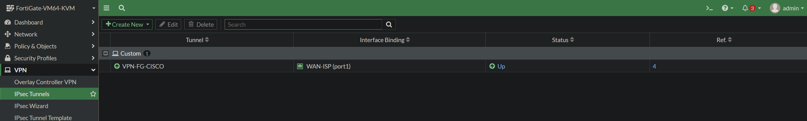
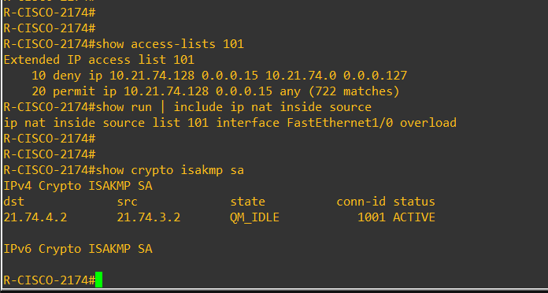
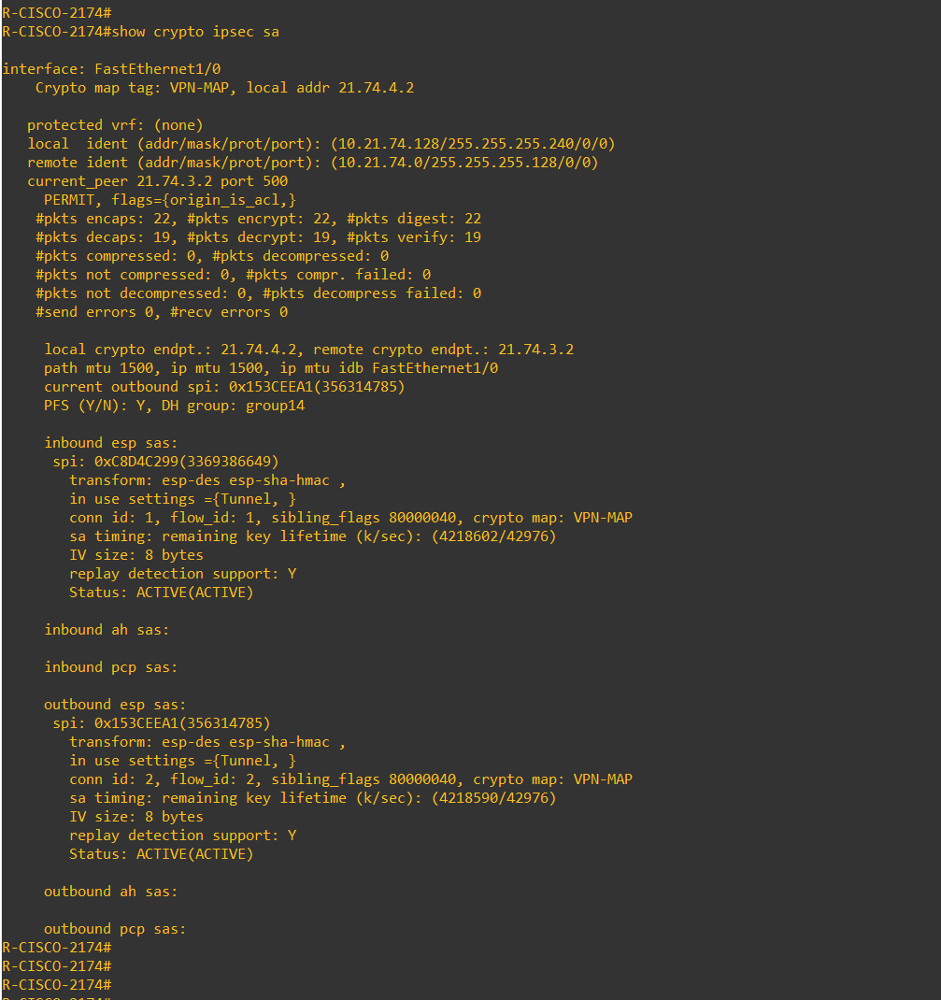
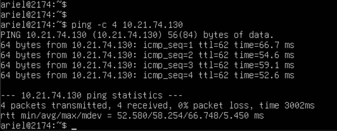
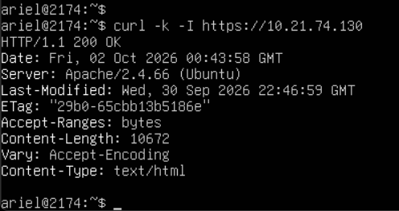
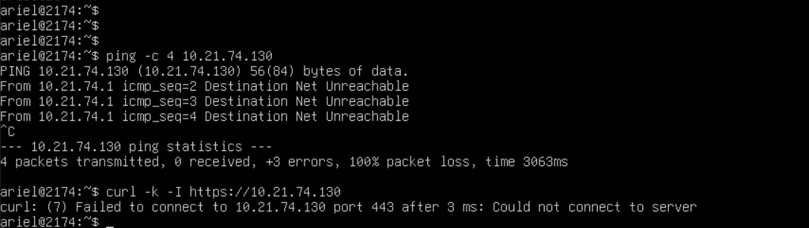
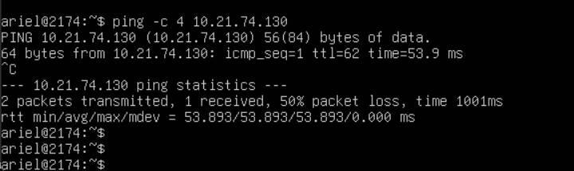

# Práctica 2 — Infraestructura 2: VPN IPsec FortiGate ↔ Cisco

> **Video de demostración:** [🎥 Ver video](PENDIENTE-URL-DEL-VIDEO)

Implementación en **GNS3** de una infraestructura donde una red de usuarios detrás de un **FortiGate** accede a un servidor HTTPS ubicado detrás de un **router Cisco**. La comunicación privada entre ambos sitios se transporta mediante un túnel **IPsec site-to-site**.


## Objetivo

Demostrar una arquitectura híbrida FortiGate–Cisco con segmentación por VLAN, DHCP, NAT/PAT, servidor HTTPS y VPN IPsec. La prueba clave consiste en validar que el usuario accede al servidor privado cuando el VPN está activo y pierde el acceso cuando el túnel se deshabilita.

## Componentes del entorno

| Equipo | Función principal |
|---|---|
| `PC-USER-2174` | Cliente en VLAN 10, direccionamiento DHCP |
| `SW-USERS-2174` | Acceso VLAN 10 y trunk 802.1Q al FortiGate |
| `FG-T2-2174` | Gateway, DHCP, NAT y extremo IPsec |
| `ISP-2174` | Tránsito entre peers y salida del laboratorio a Internet |
| `R-CISCO-2174` | Gateway del servidor, NAT exemption y extremo IPsec |
| `WEB-SV-2174` | Ubuntu Server con Apache HTTPS |

El plan IP completo está en [`docs/direccionamiento.md`](docs/direccionamiento.md).

## Diseño lógico

```text
PC-USER-2174
  10.21.74.10/25 (DHCP)
        | VLAN 10
        v
SW-USERS-2174 --trunk--> FG-T2-2174
                            port1 21.74.3.2/30
                                  |
                                  v
                              ISP-2174
                         21.74.3.1 / 21.74.4.1
                                  |
                                  v
                         R-CISCO-2174
                         WAN 21.74.4.2/30
                         LAN 10.21.74.129/28
                                  |
                                  v
                         WEB-SV-2174
                         10.21.74.130/28
```

El túnel IPsec protege el tráfico entre `10.21.74.0/25` y `10.21.74.128/28`.

## Configuración destacada

### VLAN 10 y DHCP

El FortiGate dispone de la subinterfaz `VLAN10-USERS` sobre `port2`, VLAN ID `10`, gateway `10.21.74.1/25` y pool DHCP `10.21.74.10–10.21.74.100`. El switch usa `Gi0/0` como trunk 802.1Q y `Gi0/1` como access VLAN 10.

### Salida a Internet

`USER-TO-INTERNET` permite tráfico desde `VLAN10-USERS` hacia `WAN-ISP` con NAT habilitado. El ISP realiza PAT hacia la interfaz conectada al NAT de GNS3.

### VPN IPsec

- Peer FortiGate: `21.74.3.2`
- Peer Cisco: `21.74.4.2`
- IKEv1 / Main Mode
- Autenticación con pre-shared key (**no publicada**)
- Cisco: DH Group 5, transform-set `esp-des esp-sha-hmac`, PFS group5
- Red usuarios: `10.21.74.0/25`
- Red servidor: `10.21.74.128/28`

> La PSK y las credenciales del FortiGate fueron reemplazadas/omitidas en los archivos públicos del repositorio.

### NAT exemption en R-CISCO-2174

El tráfico servidor→usuarios que pertenece al VPN se excluye de NAT. El resto del segmento `10.21.74.128/28` puede usar PAT para salir a Internet.

## Evidencia de funcionamiento

### Túnel activo





Los contadores IPsec muestran paquetes encapsulados, cifrados, desencapsulados y descifrados, demostrando tráfico real por el túnel:



### VPN ON: acceso al servidor





El servidor responde por HTTPS con `HTTP/1.1 200 OK`.

### VPN OFF: comunicación bloqueada



Al deshabilitar el VPN, el cliente deja de alcanzar `10.21.74.130` tanto por ICMP como por HTTPS.

### VPN restaurado



La validación detallada está en [`docs/validacion.md`](docs/validacion.md).

## Estructura del repositorio

```text
SR-PRACTICA-2-INFRAESTRUCTURA-2/
├── README.md
├── docs/
│   ├── direccionamiento.md
│   └── validacion.md
├── evidencias/
│   ├── 01-topologia-infraestructura-2.png
│   └── ... 18-vpn-restaurado.png
├── running-configs/
│   ├── README.md
│   ├── ISP-2174.txt
│   ├── R-CISCO-2174-sanitized.txt
│   ├── SW-USERS-2174.txt
│   └── FG-T2-2174-sanitized.conf
└── scripts/
    ├── README.md
    ├── switch-setup.txt
    ├── test-vpn-connectivity.sh
    └── web-server-https-setup.sh
```

## Evidencias incluidas

Las 18 capturas recorren la topología, interfaces, rutas, VLAN, trunk, DHCP, políticas, estado IKE/IPsec, tráfico cifrado y pruebas VPN ON/OFF.

## Seguridad del repositorio

El backup original del FortiGate **no se publica**. Contiene contraseña administrativa cifrada, material de certificados/llaves privadas y la PSK cifrada del VPN. Los archivos bajo `running-configs/` son versiones aptas para publicación y utilizan `<REDACTED_PSK>` cuando corresponde.

## Nota

Entorno académico/laboratorio. Los algoritmos usados responden a compatibilidad con las imágenes de laboratorio y no representan una recomendación criptográfica para producción.
